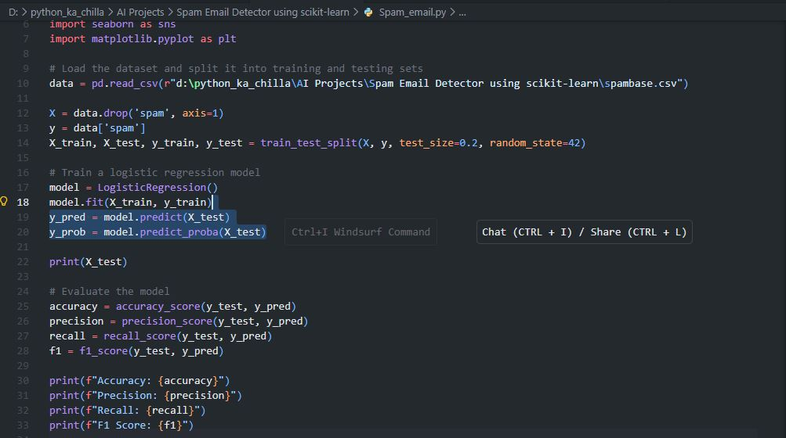
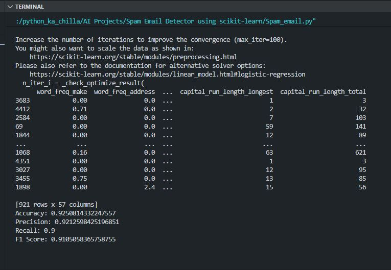
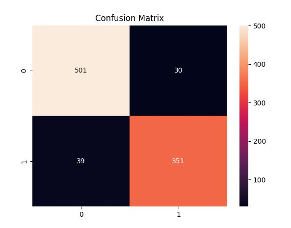

# 📧 Spam Email Detector using scikit-learn 🛡️  
      

<p align="center">
  
</p>

🚀 This project builds a **Logistic Regression** model to classify emails as spam or not spam using the **UCI Spambase dataset**. It demonstrates a complete classification pipeline: data loading, train‑test split, model training, evaluation with accuracy, precision, recall, F1‑score, and confusion matrix visualization. The model achieves about **92.5% accuracy** on the test set.

---

## ✨ Key Features  
📊 **UCI Spambase Dataset** – 4601 emails with 57 features (word frequencies, etc.)  
🧠 **Logistic Regression** – Simple yet effective binary classifier  
📈 **Comprehensive Metrics** – Accuracy, precision, recall, F1‑score  
📉 **Confusion Matrix Visualization** – Seaborn heatmap for performance insight  
⚡ **Fast Training** – Logistic regression converges quickly on this dataset  

---

## 🧠 Tech Stack  
- **Language:** Python 🐍  
- **Libraries:** pandas, scikit‑learn, matplotlib, seaborn  
- **Model:** Logistic Regression  
- **Evaluation:** Accuracy, Precision, Recall, F1‑Score, Confusion Matrix  

---

## 📦 Installation  


```bash
git clone https://github.com/SayabArshad/Spam-Email-Detector-LogisticRegression.git
cd Spam-Email-Detector-LogisticRegression
pip install pandas scikit-learn matplotlib seaborn
```
⚙️ Note: The dataset spambase.csv is not included in the repository. You can download it from the UCI Machine Learning Repository and place it in the project folder.

---

## ▶️ Usage

Run the main script:

```bash
python "Spam_email.py"
```

The script will:

Load the dataset.

Split into training (80%) and testing (20%) sets.

Train a Logistic Regression model (note: you may see a convergence warning – scaling the features would improve it).

Print accuracy, precision, recall, and F1‑score.

Display a confusion matrix heatmap.

---

## 📁 Project Structure

```
Spam-Email-Detector-LogisticRegression/
│-- Spam_email.py                     
│-- spambase.csv                        
│-- README.md                            
│-- assets/                             
│    ├── code.JPG
│    ├── output.JPG
│    └── confusion_matrix.JPG
```

---

## 🖼️ Interface Previews

## 🖼️ Interface Previews

| 📝 Code Snippet | 📊 Console Output |
|:---------------:|:-----------------:|
|  |  |

## 📉 Confusion Matrix Heatmap



---

## 💡 About the Project

Spam email detection is a classic binary classification problem. This project uses the UCI Spambase dataset, which contains 4601 emails labeled as spam (1) or not spam (0). The features include frequencies of specific words, characters, and other email attributes. A Logistic Regression model is trained on 80% of the data and evaluated on the remaining 20%. The model achieves high performance with ~92.5% accuracy, 92.1% precision, and 90% recall. The confusion matrix visualizes the number of correct and incorrect predictions. This project provides a solid baseline for spam filtering and can be extended with more advanced techniques like feature scaling, cross‑validation, or other classifiers.

---

## 🧑‍💻 Author


**Developed by:** [Sayab Arshad Soduzai](https://github.com/SayabArshad) 👨‍💻

📅 **Version:** 1.0.0

📜 **License:** MIT License

---

## ⭐ Contributions

Contributions are welcome! Fork the repository, open issues, or submit pull requests to enhance functionality (e.g., adding feature scaling, trying other algorithms, or building a web interface).
If you find this project helpful, please ⭐ star the repository to show your support.

---

## 📧 Contact

For queries, collaborations, or feedback, reach out at **[sayabarshad789@gmail.com](mailto:sayabarshad789@gmail.com)**

---

📧 Keeping your inbox clean, one email at a time.

---
